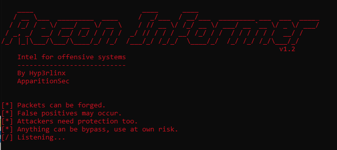

# Recon-Informer.py (v1.3)
Intel for offensive systems anti-reconnaissance tool.

By John Page (aka hyp3rlinx) Copyright (c) MIT License
Original source: http://hyp3rlinx.altervista.org/advisories/Recon-Informer.txt

Added: using -t flag we can process packets from a specific inbound IP address of interest.

Added: timestamp for the detection results in console output window.

Fix: utf-8 directive, for encoding error encountered in some older versions of Python.

Fix: check for where window size is not relevant for UDP packets to prevent errors.

Removed: script name in console window title to view CL arguments.

Recon-Informer is a basic real-time anti-reconnaissance (nmap) detection tool for offensive security systems, useful for penetration testers.
It runs on Windows/Linux and leverages scapy.

Purpose:
Recon Informer is NOT meant for protecting public facing or lan critical enterprise systems whatsoever.
Its purpose is detect possible recon against our attacker system on a LAN to provide us defensive intel.
Therefore, this script is most useful for basic short-term defensive visibility.

Features:
Attempt to detect and identify typical port scans generated using Nmap including scan type.
-sS, -sC, -F, -sR, -sT, -sA, -sW, -sN, -sF, -sX, -sM, -sZ, -sY, -sO, -sV, -sP, -sn, -f (fragment scan), -D (Decoy).

FYI, scans such as FIN don't work well on windows OS and firewalls can make scans return incorrect result.
XMAS scans work against systems following RFC 793 for TCP/IP and don’t work against any Windows versions,
NULL is another type that don't work well on Windows.

However, Fin, Null and Xmas scans can work on Linux machines. Therefore, Recon-Informer checks the OS
its run on and reports on scans that affect that OS, unless the -s "scan_type" flag is supplied.
With -s flag you can add extra scan types to detect that otherwise would be ignored.

PING SWEEP (-sP, -sn, -sn -PY, -sY -PY) disabled by default.
Not enabled by default as most Nmap scans begin with an ARP who-has request, when using -p flag you
will see this detection preceding most scans. Also, you may see (noise) non-reconaissance related ARP
requests or even ones resulting from your own ICMP pings, this exclusive detection may fail if a scan uses -Pn flag.

ICMP
Note: If nmap --disable-arp-ping flag is supplied for the scan it will be detected as ICMP ping.

BLOCK -b offending IP(s) default is no blocking as packets can be spoofed causing DoS.
Firewall rule for blocks are in-bound "ANY" but still allows out-bound.
FW rules are named like ReconInformer_<HOST-IP>.

DELETE FW RULE -d <IP-ADDR> to remove FW rules for blocked hosts.

WHITELIST -w HOST-IP(s) you never want to block on.

FILTER DEST PORTS -f (filter_dst_port) cut down noisy ports like TCP 2869, NetBIOs 137 etc.
ignore packets destined for specific ports to try reduce false positive probe alerts.

IGNORE HOST -n don't process packets from specific hosts, e.g. intranet-apps, printers and ACKS
from SMB connected shares to try reduce false positives.

LOG -l flag, default size limit for writing to disk is 1MB.

UDP protocol is ignored by default to try reduce false positives from sources like NetBIOS, SNMP etc.
To detect UDP scans use the -u flag, then can also combine with -f port filter
(reduce noise) on specific dest ports like 137,161,1900,2869,7680.

PCAP saving -s flag, default size limit is also 1MB.

RESTORE CONSOLE -r focus the console window (Win OS) if console is minimized on port scan detect.

Private Network range:
Wrote this for basic LAN visibility for my attacker machine, packets from public IP ranges are ignored. 

BYPASS examples --scanflags and custom packet window sizes:
Recon-Informer does not try to detect every case of --scanflags or specially crafted packets.

These scans can bypass Recon-Informer and correctly report open ports found.
nmap -n -Pn -sS --scanflags PSHSYN x.x.x.x -p139
nmap -P0 -T4 -sS --scanflags=SYNPSH x.x.x.x

Therefore, I accounted for some of these in Recon-Informer to report these detections.

SCANFLAGS
nmap -P0 -T4 -sS --scanflags=SYNURG x.x.x.x -p139 (returns correct)
nmap -P0 -T4 -sS --scanflags=PSHSYNURG x.x.x.x -p21-445 (returns correct)
nmap -P0 -T4 -sS --scanflags=ECE x.x.x.x shows up as NULL scan (nothin useful returned)
nmap -n -Pn -sS --scanflags 0x42 x.x.x.x -p139 (useful)
nmap -n -Pn -sS --scanflags=SYNPSH x.x.x.x -p135 (useful)

The above scanflag examples, would have bypassed detection if we didn't check packets for them.
Useful scanflags that return open ports and bypassed Recon-Informer prior to scanflag checks:

10=(0x00a) SYNPSH
34= (0x22) SYNURG
42=(0x02a) SYNPSHURG
66 (0x42) SYNECN
74 (0x04a) SYNPSHECN
98 (0x062) SYNURGECN
106 (0x06a) SYNPSHURGECN
130 (0x082) SYNCWR
138 (0x08a) SYNPSHCWR
162 (0x0a2) SYNURGCWR
170 (0x0aa) SYNPSHURGCWR
194  (0x0c2) SYNECNCWR
202 (0x0ca) SYNPSHECNCWR
226 (0x0e2) SYNURGECNCWR
234 (0x0ea) SYNPSHURGECNCWR

Custom packet window size from 1024 typical of Nmap SYN scans to a size of 666 for the bypass!.
ip=IP(dst="192.168.1.104")
syn=TCP(sport=54030,dport=139,window=666,flags="S")
send(ip/syn)

Custom packet tests were tested on Kali to Win7/10 machines.
Recon-Informer trys to inform about most typical out-of-the-box type of scans.

Service scans -A detection:
nmap -n -Pn -T4 -A x.x.x.x -p22
If we scan from Kali Linux to Windows machine port 23 using -A we see SYN followed by XMAS
also we see an immediate high port of like 30000 or more.

But scanning Windows ports 135 - 139 we see FSPU flags set so we can be fairly confident 
it is a Service scan -A also it usually is followed by scanning high ports of 30000 or greater.

However, I found that an easier way to pick up service -A scans is checking the window size.
If the window size is 65535 we can be fairly certain its a service -A scan.
Sometimes -A scan seems only to be detected when certain ports are hit.

Example, Windows ports 135,139 or Kali Linux ports 1, 22 etc...
If not targeting port 135/139 (windows) -A detect may get missed.
Testing on newest nmap on Kali seemed to be easier to detect -A scan on ports other than 135/139.
Anyway, added this to try get more intel about possible incoming probes.

DECOY SCAN -D detection set to a threshold of two or more ip-addresses.

Examples:
capture TCP packets only, restores console on detection, detect ping sweep and ICMP
Recon-Informer.py -i <ATTACKER-BOX> -r -p

capture UDP, whitelist ips, block, log, restore console, save pcap, detect XMAS,NULL on Win OS box.
Recon-Informer.py -i <ATTACKER-BOX> -u  -w -b -l -r -a -s X,N

capture UDP, filter ports, whitelist ips, block and deletes a previous FW rule
Recon-Informer.py -i <ATTACKER-BOX> -u -f 137,161  -w -b -d <HOST-IP>

ignore specific hosts for whatever reason you may have
Recon-Informer.py -i <ATTACKER-BOX> -n host1, host2

capture TCP packets block all offending hosts (in-bound only) on detection, filter port 7680 MS WUDO
Recon-Informer.py -i <ATTACKER-BOX> -b -f 7680

Dependencies:
npcap or winpcap, scapy, clint.

Tested Win7/10/Linux/Kali - Wired Ethernet LAN and Wifi networks.

Scapy Errors:
If get scapy runtime error "NameError: global name 'log_runtime' is not defined on scapy"
OR you get "ImportError: cannot import name NPCAP_PATH"
Download the latest https://github.com/secdev/scapy
They were bugs in scapy thats been fixed in 2.4.3.

Packet window size tests:

CONNECT -sT scan window size anomalies and example of port detection bypass.
Whats nice about detecting CONNECT scans is if someone does a telnet x.x.x.x <port> it
should also get flagged by Recon-Informer. FYI, if SYN scan is run as non-root user
it becomes CONNECT scan.

1) Custom scapy CONNECT scan from Kali to Win7/Win10 box with SYN flag set window size is 8192
2) Nmap -sT CONNECT Win10 to Win7 used window size of 64240
3) Nmap -sT CONNECT i686 i386 GNU/Linux box with Nmap v4.11 to Win7/Win10 had window size 5840
4) Nmap -sT CONNECT Kali to Win7/Win10 used window size of 29200
5) Nmap -sT CONNECT Win7 to Win10 also window size was 8192 as in case 1) 

Nmap versions 4.11, 7.70 and 7.80 were used for port scan testing:
However, we may not be able to catch them all, like when custom window size is used.

False positives:
Some ports (MS UPNP Host port 2869) as they show up as CONNECT or MAIMON
scans on some noisy networks. HTTP GET requests can also be flagged as CONNECT scans.
TCP source port 443 can also get picked up from web browsers or webapps.

VM and NAT setups:

TEST -sZ COOKIE_ECHO:
1) Kali to Win (NAT) we see 3-way handshake and no SCTP packets
2) Win to Win 10. range we see the SCTP packets

TEST -sT CONNECT
1) Win to Win 10.x.x.x range we see correct packets in wireshark
SYN packet with a large amount of TCP options

If use NAT mode on VM the machine may perform 3-way handshake
Recon-Informer may report SYN scans as CONNECT scans as they become ambigous.

DISCLAIMER:
Author is NOT responsible for any damages whatsoever by using this software,
by using Recon Informer you assume and accept all risk implied or otherwise.

